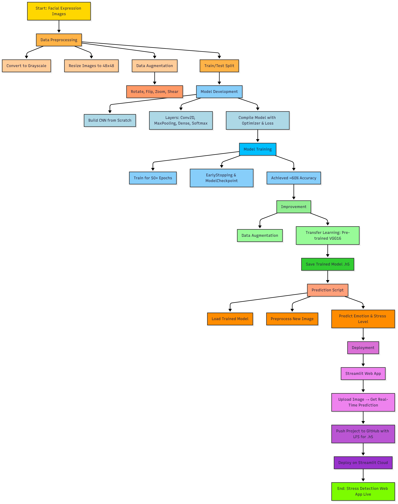

# 🧠 CNN-Based Stress Detection Project

## 📌 Project Overview

This project is a **facial expression-based stress detection system**. The goal is to automatically detect stress levels in a person using a deep learning model trained on facial images.  

We built a **Convolutional Neural Network (CNN)** to classify facial expressions into emotions like *happy, angry, sad, neutral*, etc., which helps estimate stress.  

The model is deployed as a **web application using Streamlit**, so users can upload images and instantly see predictions.

🔗 [Live demo of the project](https://cnnstressdetectionproject-lgdtggbwp6s2njmp5qpadg.streamlit.app//)


## Workflow


---

## 🔍 What We Did Step by Step

1. **Data Collection**
   - Collected facial expression images from a dataset.
   - Images were labeled with emotions.

2. **Data Preprocessing**
   - Converted images to **grayscale** for model training.
   - Applied **data augmentation** (like rotation, zoom, flips) to increase dataset size and make the model robust.

3. **Model Development**
   - Built a **CNN from scratch** to classify emotions.
   - Used layers like Conv2D, MaxPooling, and Dense.
   - Trained the model on the preprocessed images.

4. **Training and Evaluation**
   - Trained the model using 50+ epochs.
   - Monitored validation accuracy and used **EarlyStopping** to prevent overfitting.
   - Achieved around **60% accuracy** on original grayscale images.

5. **Improving Accuracy**
   - Applied **data augmentation** to increase dataset variability.
   - Experimented with **transfer learning** using pre-trained models (like VGG16) to leverage existing knowledge and improve performance.

6. **Prediction**
   - Built a Python script to load the trained model and predict stress from **new images**.
   - Converted color images to grayscale if necessary to match training format.

7. **Deployment**
   - Used **Streamlit** to create an interactive web app.
   - Users can upload images and get **real-time stress predictions**.
   - Pushed the project to **GitHub** and used **Git LFS** for storing the trained model (`.h5` file).
   - Deployed successfully on **Streamlit Cloud**.

---

## 🛠 Technologies Used

- **Python 3.x**
- **Deep Learning**: TensorFlow / Keras
- **Web Deployment**: Streamlit
- **Data Processing**: NumPy, OpenCV, PIL
- **Version Control**: Git & GitHub (with Git LFS for large files)

---

## 🚀 How to Run Locally

1. Clone the repository:

   ```bash
   git clone https://github.com/Debbatisudheer/cnn_stress_detection_project.git
   cd cnn_stress_detection_project

   
2. Create and activate a virtual environment:
   
   ```bash
   python -m venv venv
   source venv/bin/activate  # On Windows: venv\Scripts\activate

3. Install dependencies:

   ```bash
   pip install -r requirements.txt


4. Run the Streamlit app:
   ```bash
   streamlit run app.py
   
🎯 Key Features
Real-time stress detection from facial expressions

Handles image uploads easily

Uses CNN and transfer learning for better accuracy

Interactive web app with Streamlit

1. ## Project Structure

```python
project_2/
│
├── archive/
│   ├── train/               # Training images organized in class folders
│   └── test/                # Testing images organized in class folders
│
├── src/
│   ├── data_loader.py       # Loads dataset and applies augmentation
│   ├── evaluate.py          # Evaluates model performance
│   ├── model.py             # CNN architecture / transfer learning
│   ├── train.py             # Training script (from scratch)
│   └── train_transfer.py    # Transfer learning training script
│
├── saved_models/
│   ├── cnn_stress_model.h5  # Trained CNN model
│
├── app.py                   # Streamlit web application
├── run.py                   # Optional script to run app or pipeline
├── requirements.txt         # Python dependencies
├── predict.py               # Prediction script for new images
└── README.md                # Project documentation
```


Locally: You run python run.py → the train_model() function is executed, training starts, and the model gets saved.

During deployment: Streamlit (or any other script) imports the train_model function to use it, but the training doesn’t start again because it’s inside the if __name__ == "__main__": block — which only runs when the file is executed directly.

So basically, this prevents unwanted retraining and keeps your workflow safe and modular.


1. code flow:
   ```bash
   run.py
        │ 
        └── train.py
                   │ 
                   └── data_loader.py , model.py


1. run.py
   ```bash
   --> entry point --> we are brining the function train() from train.py
   --> we are using if __name__ == "__main__": to run directly(terminal) inside this statement, without this python would start training automatically just because we imported the file, we can import functions/classes without  triggering code , no wanted tranings start automatically, for example: if straemlit app or api imports train model it wont start training eveytime the server starts if only use the function when needed.
   --> train_dir, test_dir  holdes images path , train_model(train_dir, test_dir, resume=True)  this takes those path for the traning and it returns model,
   ---> history.def train_model(train_dir, test_dir, saved_model_path="saved_models/cnn_stress_model.h5", resume=False): this function takes those paths and save the model
   --> also load_data(train_dir, test_dir) function will takes that images path and returns train_generator, test_generator
   -->  it imports the build_cnn() function and returns the model and we have callbacks and  this function will start training the model model.fit(
        train_gen,
        epochs=50,   # you can change this to 100, 200, etc.
        validation_data=test_gen,
        callbacks=callbacks
    ) and it returns the history and as well as model

   Key Difference:

Python: if __name__ == "__main__": is a conditional check to decide whether to run code when file is executed directly.

Go: func main() is the entry point where program execution always begins.

Think like this 👇

Python: "Should I run this file directly or not?"

Go: "Start here always!"


